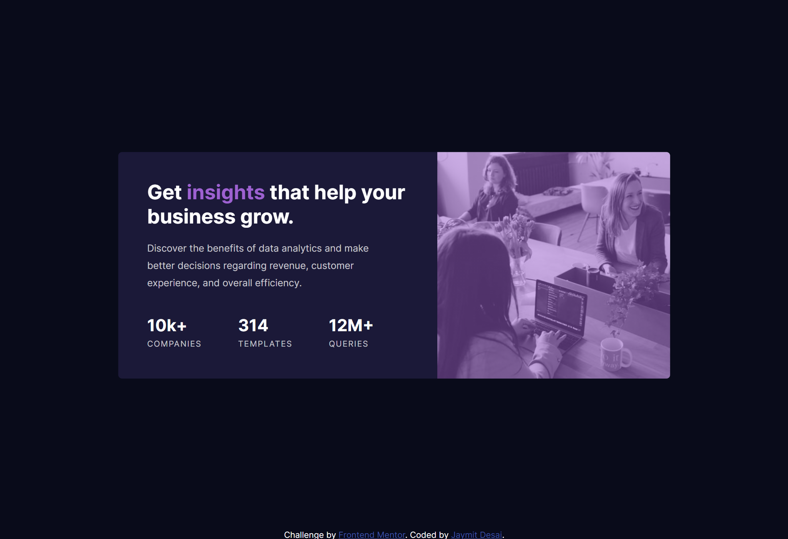

# Frontend Mentor - Stats preview card component solution

This is a solution to the [Stats preview card component challenge on Frontend Mentor](https://www.frontendmentor.io/challenges/stats-preview-card-component-8JqbgoU62). Frontend Mentor challenges help you improve your coding skills by building realistic projects. 

## Table of contents

- [Overview](#overview)
  - [The challenge](#the-challenge)
  - [Screenshot](#screenshot)
  - [Links](#links)
- [My process](#my-process)
  - [Built with](#built-with)
  - [What I learned](#what-i-learned)
  - [Continued development](#continued-development)
  - [Useful resources](#useful-resources)
- [Author](#author)


## Overview

### The challenge

Users should be able to:

- View the optimal layout depending on their device's screen size

### Screenshot




### Links

- Solution URL: [Add solution URL here](https://your-solution-url.com)
- Live Site URL: [https://jaydesai-stats-preview-card.netlify.app/](https://jaydesai-stats-preview-card.netlify.app/)

## My process

### Built with

- Semantic HTML5 markup
- CSS custom properties
- Flexbox
- CSS Grid
- Mobile-first workflow
- SCSS Preprocessor


### What I learned

1. How to use picture tag to make image tag responsive, below snippet shows how to manage images based on screen size

```html
      <picture class="preview__card__header">
        <source srcset="./images/image-header-desktop.jpg 768w">
        <source srcset="./images/image-header-mobile.jpg 320w">
        
          </picture>    
```


2. Continuation of above,Adding overlay for picture tag, picture tag is inline so it doesnt have its own height and width, changing display to block and using relative positioning with ::after selector to assign overlay background does the tricks.
```css
  .preview__card {
    &__header {
      display: block;
      position: relative;
      img {
        position: relative;
        object-fit: cover;
        width: 100%;
        height: 100%;
        display: block;
      }     
      &::after {
        content: "";
        position: absolute;
        top: 0;
        left: 0;
        width: 100%;
        height: 100%;
        background: linear-gradient(var(--color-primary-light), var(--color-primary-light));
      }
    }
  }
```

3. If inner content is overflowing and not displaying the radius of border, user overflow:hidden

https://markheath.net/post/keep-inside-rounded-corners-css


If you want more help with writing markdown, we'd recommend checking out [The Markdown Guide](https://www.markdownguide.org/) to learn more.


### Continued development
Understand responsive images in a better way

### Useful resources

- [Overlay Color / Tinted Effec](https://css-tricks.com/tinted-images-multiple-backgrounds/) - This helped with understanding how achieve the tinted effect using css
- [Using picture html5 tag for responsive images](https://www.smashingmagazine.com/2014/05/responsive-images-done-right-guide-picture-srcset/) - Amazing tutorial on how to manage images using html5 tag picture
- [Using object-fit and object-position](https://www.sitepoint.com/using-css-object-fit-object-position-properties/)
-[overlay gradient on image tag](https://www.solodev.com/blog/web-design/how-to-add-transparent-overlays-to-images-with-css.stml)
- [When to use margin vs padding](https://stackoverflow.com/questions/2189452/when-to-use-margin-vs-padding-in-css)

Leant about text properties
- [text-align](https://css-tricks.com/almanac/properties/t/text-align/)
- [text-justify](https://css-tricks.com/almanac/properties/t/text-justify/)
- [letter-spacing](https://css-tricks.com/almanac/properties/l/letter-spacing/)
- [text-transform](https://www.w3schools.com/cssref/pr_text_text-transform.asp)


## Author

- Website - [Jaymit Desai](https://www.jaymitdesai.com)
- Frontend Mentor - [@jaymitd](https://www.frontendmentor.io/profile/jaymitd)
- Github - [@jaymit123](https://github.com/jaymit123)

